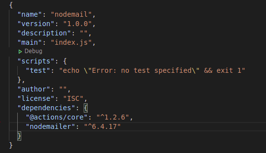

## Práctica Mejora Proyecto Cliente con Github Actions
##### *Raúl Menéndez 2 ºDAW*
## Índice:
 + Introducción
    - Sintaxis de flujo de trabajo para acciones de GitHub
 + Tecnologias utilizadas
    - Javascript ES6
    - Node.js
    - WebSockets
    - Socket.io
    - Nodemailer
    - Jest
    - Surge
 + Desarrollo de las mejoras
    - Job 1 (Syntax Check Job)
    - Job 2 (Test Execution Job)
    - Job 3 (Build Statics Job)
    - Job 4 (Deploy Job)
    - Job 5 (Deploy Job)
    - Job 6 (Update Readme Job)

### Introdución

Este proyecto es la mejora con github actions de una aplicación web para jugar al bingo, realizada en el módulo de Cliente.

#### Sintaxis de flujo de trabajo para acciones de GitHub

Un flujo de trabajo es un proceso automatizado configurable compuesto por uno o más trabajos. Debe crear un archivo YAML para definir la configuración de su flujo de trabajo.

### Tecnologias utilizadas

#### Javascript ES6

Es un lenguaje de programación interpretado, dialecto del estándar ECMAScript. Se define como orientado a objetos, basado en prototipos, imperativo, débilmente tipado y dinámico.

El proyecto del bingo está construido con Javascript, en la versión de ECMAScript 6.

#### Node.js

Node.js es un entorno en tiempo de ejecución multiplataforma, de código abierto, para la capa del servidor basado en el lenguaje de programación JavaScript asíncrono.

#### WebSockets

WebSocket es una tecnología que proporciona un canal de comunicación bidireccional y full-duplex sobre un único socket TCP. Está diseñada para ser implementada en navegadores y servidores web, pero puede utilizarse por cualquier aplicación cliente/servidor.

#### Socket.io

Socket.IO es una biblioteca que permite la comunicación en tiempo real, bidireccional y basada en eventos entre el navegador y el servidor.

#### Nodemailer

Nodemailer es un módulo para aplicaciones Node.js que permite el envío de correos electrónicos de forma sencilla.

#### Jest

Jest es un marco de prueba de JavaScript mantenido por Facebook, Inc. diseñado y construido por Christoph Nakazawa con un enfoque en la simplicidad y soporte para grandes aplicaciones web. 

Funciona con proyectos que utilizan Babel , TypeScript , Node.js , React , Angular , Vue.js y Svelte. Jest no requiere mucha configuración para los usuarios nuevos de un marco de prueba.

#### Surge

Publicación web simple y con un solo comando. Publique HTML, CSS y JS de forma gratuita, sin salir de la línea de comandos.

Visita la [web](https://surge.sh/).

### Desarrollo de las mejoras

Esta práctica consistirá en aplicar una serie de mejoras sobre el proyecto realizadoen la asignatura de Cliente del primer trimestre. Todos estos cambios se deberánrealizar en una nueva rama que se denominará “githubActions_improvement”.

Los cambios arealizar consistirán en configurar un nuevo   workflow dentro del proyecto denominado Bingo_Workflow. Dicho workflow sólo se ejecutará cuando se realice un push en la rama creada y estará compuesto por los siguientes jobs:

Vamos a empezar creando el directorio para el workflow:

Dentro del directorio workflows creamos el archivo bingo_workflow.yml, acto seguido le añadimos lo siguiente:

#### Job 1 (Syntax Check Job)

##### Requisitos

Job   de   verificación   de   sintaxis   correcta.   Se   denominará syntax_check_job y se encargará de realizar la descarga del proyecto y de verificar que la sintáxis utilizada és correcta en los ficheros javascript.

##### Desarrollo

Empezamos configurando el archivo .yml:

Ahora haremos commit para comprobar el funcionamiento:

Como podemos comprobar el workflow se ha ejecutado perfectamente.

#### Job 2 (Test Execution Job)

##### Requisitos

Job de ejecución de tests. Se denominará test_execution_job y, se encargará de ejecutarlos y verificar que todos funcionan como se esperaba. 

##### Desarrollo

Creamos el job en el archivo bingo_workflow.yml:

Utilizaremos jest para realización de los test.
Actualizamos los cambios en el repositorio remoto.

Como podemos comprobar el workflow se ha ejecutado perfectamente.

#### Job 3 (Build Statics Job)

##### Requisitos

Se denominará build_statics_job.
Este job será el encargado de realizar el proceso de compilado del proyecto. Se realizará siempre que hayan terminado los 2 jobs anteriores y depositará los artefactos generados en la ruta build.

##### Desarrollo

Creamos el job en el archivo .yml:

Hacemos push para actualizar los cambios y que se ejecuten los workflows:

En la imagen vemos que este job depende de los dos anteriores para poder ejecutarse.

Dentro del job podemos ver que nos ha mostrado un mensaje de que ha ido todo bien:

#### Job 4 (Deploy Job)

##### Requisitos

 Job de despliegue de los estáticos   generados. 
 Se denominará deploy_job y, partiendo de los estáticos generados en el job anterior (por eso siempre se ejecutará tras el job anterior), desplegará el proyecto en surge.sh. 
 
 Por supuesto, necesitará configurar una serie de variables de entorno algunas de las cuales, al contener valores comprometidos, serán secrets de nuestro repositorio github.

##### Desarrollo

Empezamos instalando y configurando surge para poder desplegar la aplicación. 

Abrimos una terminal y ejecutamos los siguientes comandos:

 + `npm install --global surge`

 + `surge`

Tendremos que configurar un nombre de dominio, un correo y una contraseña:

 

Ahora creamos el job:

 

Para poder desplegar la aplicacion con el workflow tenemos que configurar los secrets en github:

Para conseguir el token de surge ejecutamos el comando:
+ `surge token`

Actualizamos el repositorio.

Podemos ver la estructura de los jobs y como se realizará despues del job anterior:

Comprobamos que todo ha ido bien:

Si vamos a [rmenendez_bingo.surge.sh](rmenendez_bingo.surge.sh) veremos que la aplicación está desplegada:

#### Job 5 (Deploy Job)

##### Requisitos

Job de envío de notificación a los usuarios del proyecto. Se denominará notification_job y ejecutará, entre otros, una action propia que podrá basarse en Javascript o en Docker. 

Se ejecutará siempre (aunque se haya producido un error en algún job previo), y se encargará de enviar un correo con:

*Destinatario:* dirección de correo vuestra personal tomada de un secret de github.

*Asunto:* Resultado del workflow ejecutado.

*Cuerpo del mensaje:* Se ha realizado un push en la rama githubActions_improvement que ha   provocado la ejecución del workflow Bingo_Workflow con los siguientes resultados:
- syntax_check_job: resultado asociada
- test_execution_job: resultado asociada
- build_statics_job: resultado asociada
- deploy_job: resultado asociada

##### Desarrollo

Creamos la estructura de directorios y ficheros para poder ejecutar el job:

Primero instalaremos el modulo nodemailer y el de @actions/core:

+ `npm init`
+ `npm install nodemailer`
+ `npm install @actions/core`

El archivo package.json debe quedar así:

Crearemos un index.js que tendrá el código para poder enviar el mensaje.

También creamos un archivo llamado action.yml que tendrá los parámetros de entrada de los otros jobs:

También tendremos que configurar los outputs de los jobs. Para ello, en el archivo bingo_workflow.yml añadiremos un parámetro nuevo en cada job. Este va a la altura de "steps".

Para compilar el proyecto utilizaremos vercel, ejecutamos los siguientes comandos:
+ `npm install -g @vercel/ncc`
+ `ncc build index.js`

Ahora, creamos los secrets en Github:

Por último, vamos a la configuración de nuestra cuenta gmail y permitimos el acceso a aplicaciones de terceros.

Una vez realizado todo lo anterior realizamos el push.
El resultado de la action es el siguiente:

Si todo ha ido bien deberíamos recibir un correo:

#### Job 6 (Update Readme Job)

##### Requisitos

Job de actualización del README principal del   proyecto. Se denominará update_readme_job y se ejecutará sólo si el job encargado de realizar el deploy (deploy_job) ha funcionado correctamente. 

Su finalidad será actualizar el contenido del README principal del proyecto para quemuestre un texto al final con “Ultima versión desplegada el día: FECHA_DE_ÚLTIMO_DESPLIEGUE”.

##### Desarrollo

Creamos el job en el archivo bingo_workflow.yml:

Actualizamos el repositorio remoto.

Si vamos al README.md del proyecto veremos que se ha añadido una línea al final del archivo:

